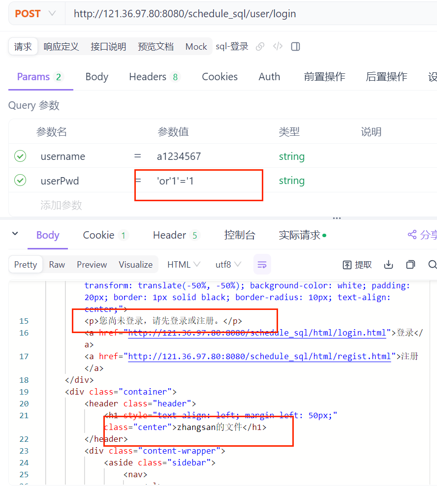

# 一、sql注入漏洞
实现登录功能时，特意采用了采用字符串拼接的方式完成SQL查询命令的组装：
```java
public SysUser findByNamePwd(String username, String userPwd) {// 只查询 username 字段
    String sql = "SELECT username FROM sys_user WHERE username = '" + username + "' AND user_pwd = '" + userPwd + "'";
    List<SysUser> sysUserList = baseQuery(SysUser.class, sql);
    return sysUserList != null && !sysUserList.isEmpty() ? sysUserList.get(0) : null;
}
```
此时假设有人知道了某用户名（账户）就可以使用万能密码```' or '1'='1  ```强行登录

在此之外还可以通过SQL拼接串：  
``' UNION SELECT database() '``  
获取数据库名