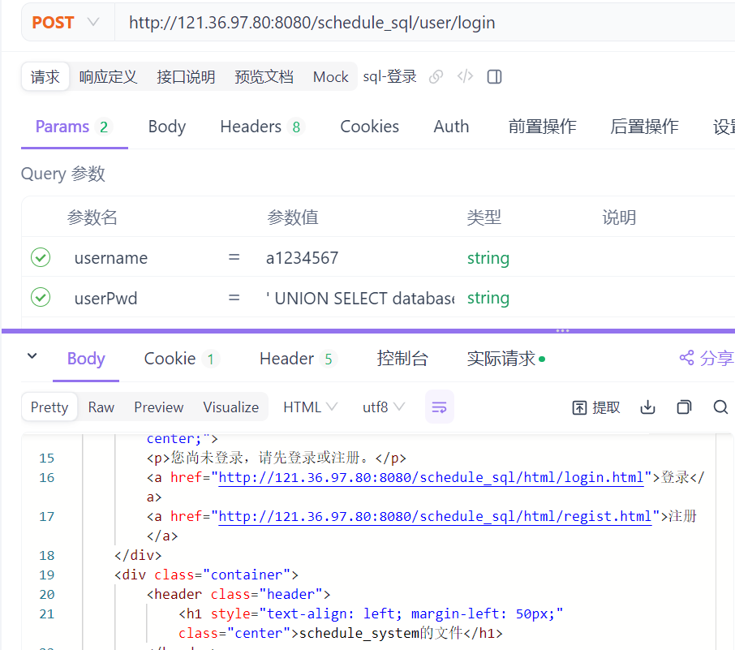
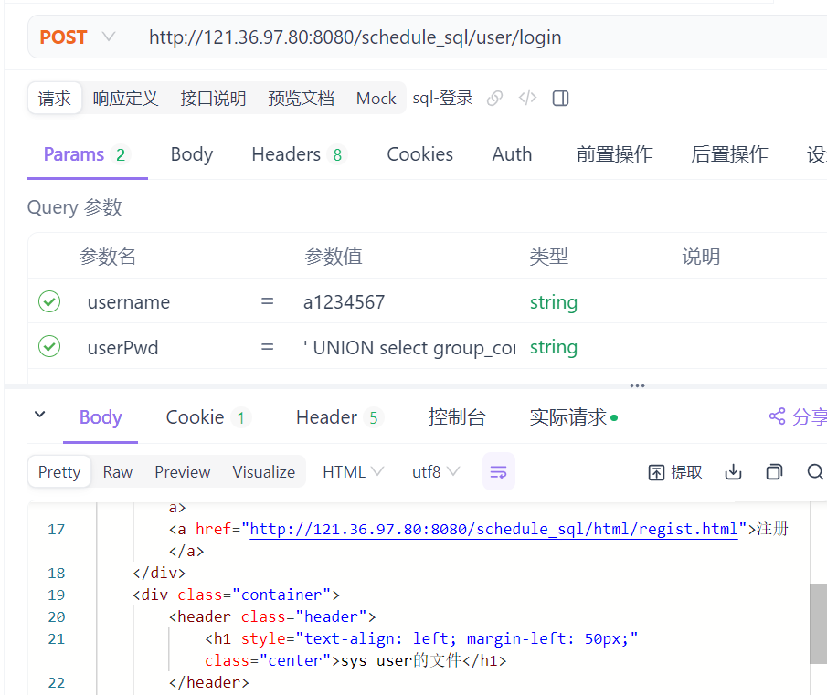
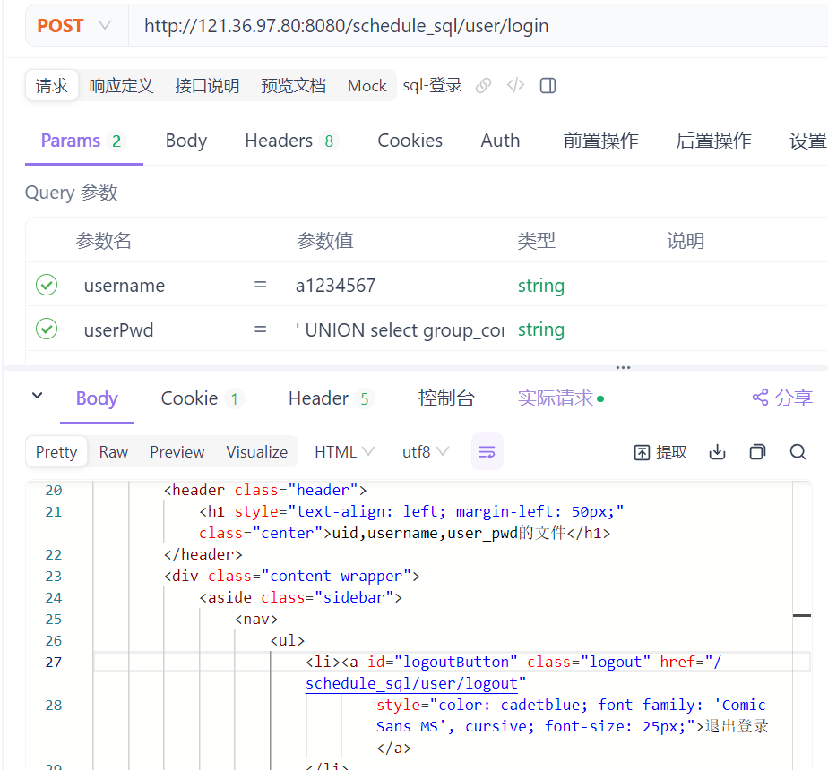
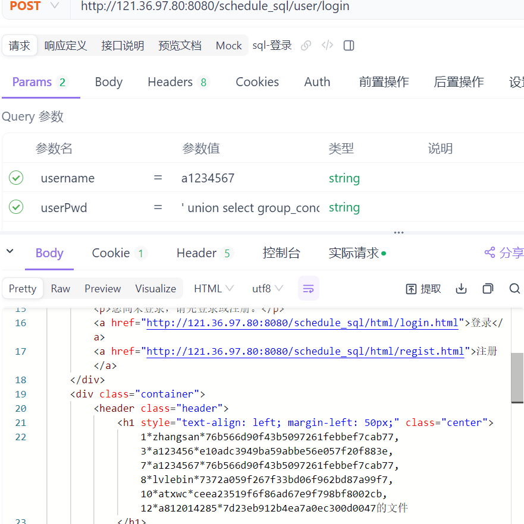
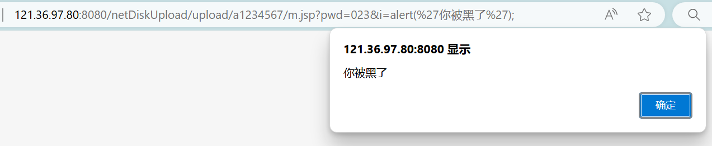
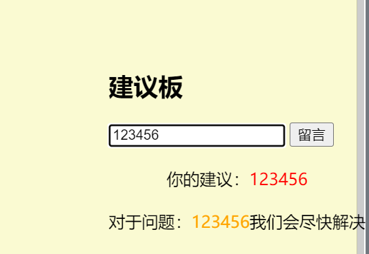
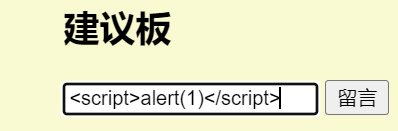
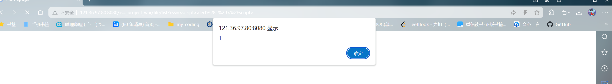
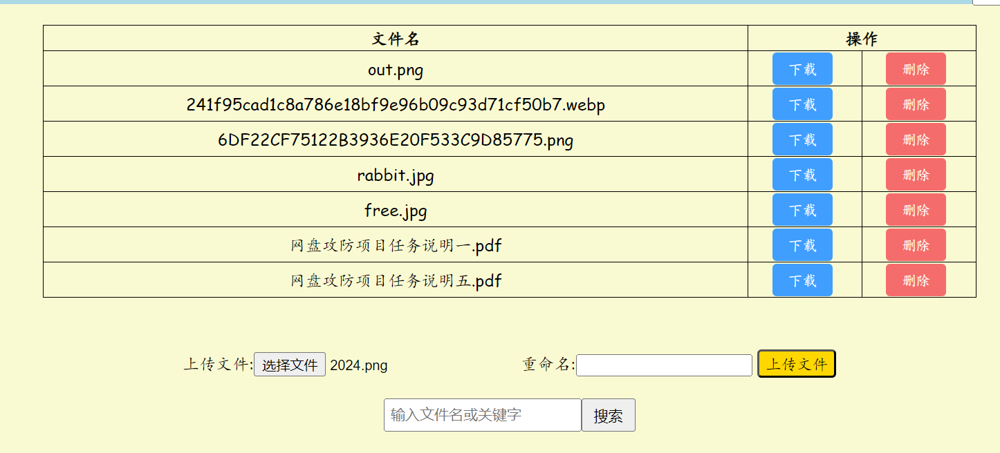
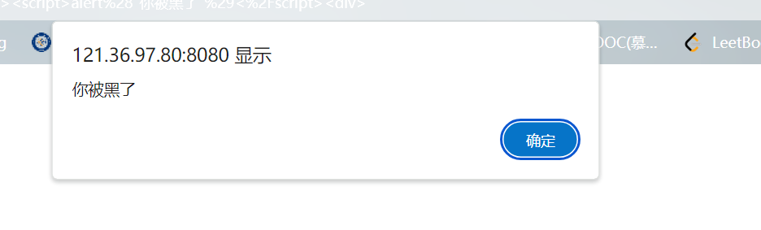

# 一、sql注入漏洞
实现登录功能时，特意采用了采用字符串拼接的方式完成SQL查询命令的组装：
```java
public SysUser findByNamePwd(String username, String userPwd) {// 只查询 username 字段
    String sql = "SELECT username FROM sys_user WHERE username = '" + username + "' AND user_pwd = '" + userPwd + "'";
    List<SysUser> sysUserList = baseQuery(SysUser.class, sql);
    return sysUserList != null && !sysUserList.isEmpty() ? sysUserList.get(0) : null;
}
```
### 强行登录
此时假设有人知道了某用户名（账户）就可以使用万能密码```' or '1'='1  ```强行登录


### 获取数据库名

在此之外还可以通过SQL拼接串：``' UNION SELECT database() '``获取数据库名



### 获取表名

通过SQL拼接串：``' UNION SELECT table_name FROM information_schema.tables WHERE table_schema='数据库名'  ``获取表名



### 获取字段名
通过SQL拼接串：``' UNION SELECT column_name FROM information_schema.columns WHERE table_name='表名'  ``获取字段名


### 获取字段值

通过SQL拼接串：``' UNION SELECT 字段名 FROM 表名  ``获取字段值


## 漏洞修复

1. 使用预编译的方式，将SQL语句和参数分开，避免SQL注入
```java
public SysUser findByNamePwd(String username, String userPwd) {
    String sql = "SELECT username FROM sys_user WHERE username = ? AND user_pwd = ?";
    List<SysUser> sysUserList = baseQuery(SysUser.class, sql, username, userPwd);
    return sysUserList != null && !sysUserList.isEmpty() ? sysUserList.get(0) : null;
}
```
2. 使用ORM框架，如MyBatis，Hibernate等，避免手动拼接SQL
```java
public SysUser findByNamePwd(String username, String userPwd) {
    return sysUserMapper.findByNamePwd(username, userPwd);
}
```
3. 更换登录逻辑，不再使用明文密码，而是使用加密后的密码进行比对
```java
public SysUser findByNamePwd(String username, String userPwd) {
    String sql = "SELECT username FROM sys_user WHERE username = ? AND user_pwd = ?";
    List<SysUser> sysUserList = baseQuery(SysUser.class, sql, username, MD5Util.encrypt(userPwd));
    return sysUserList != null && !sysUserList.isEmpty() ? sysUserList.get(0) : null;
}
```
# 二、文件下载漏洞
在下载文件时，没有对文件名进行过滤，导致可以下载任意文件
```java
protected void download(HttpServletRequest req, HttpServletResponse resp) throws ServletException, IOException {
        // 从请求参数中获取文件名
        String fileName = req.getParameter("fileName");
        // 获取应用的根目录的真实路径
        String userPath = req.getServletContext().getRealPath("/upload");
        // 获取用户名
        String userName = (String) req.getSession().getAttribute("username");
        // 构造文件路径
        String filePath = userPath + "/" + userName + "/" + fileName;

        /*// 验证路径
        if (!filePath.startsWith(userPath + "/" + userName + "/")) {
            resp.setContentType("text/html;charset=UTF-8");
            resp.getWriter().write("<h2>Invalid file path</h2>");
            resp.getWriter().close();
            return;
        }*/

        File file = new File(filePath);
        if (file.exists() && file.isFile()) {
            resp.setContentType("application/octet-stream");
            resp.setHeader("Content-Disposition", "attachment; filename=" + URLEncoder.encode(fileName, "UTF-8"));

            InputStream in = new FileInputStream(file);
            OutputStream out = resp.getOutputStream();

            byte[] buffer = new byte[4096];
            int length;
            while ((length = in.read(buffer)) > 0){
                out.write(buffer, 0, length);
            }
            in.close();
            out.flush();
        } else {
            resp.setContentType("text/html;charset=UTF-8");
            resp.getWriter().write("<h2>要下载的文件不存在</h2>");
            resp.getWriter().close();
        }
    }
```
当文件名包含``../``时，可以下载任意文件
```
http://localhost:8080/JavaWebDemo/download?fileName=../web.xml
```

## 漏洞修复

1. 对文件名进行过滤，只允许下载指定目录下的文件
```java
protected void download(HttpServletRequest req, HttpServletResponse resp) throws ServletException, IOException {
        // 从请求参数中获取文件名
        String fileName = req.getParameter("fileName");
        // 获取应用的根目录的真实路径
        String userPath = req.getServletContext().getRealPath("/upload");
        // 获取用户名
        String userName = (String) req.getSession().getAttribute("username");
        // 构造文件路径
        String filePath = userPath + "/" + userName + "/" + fileName;

        // 验证路径
        if (!filePath.startsWith(userPath + "/" + userName + "/")) {
            resp.setContentType("text/html;charset=UTF-8");
            resp.getWriter().write("<h2>Invalid file path</h2>");
            resp.getWriter().close();
            return;
        }

        File file = new File(filePath);
        if (file.exists() && file.isFile()) {
            resp.setContentType("application/octet-stream");
            resp.setHeader("Content-Disposition", "attachment; filename=" + URLEncoder.encode(fileName, "UTF-8"));

            InputStream in = new FileInputStream(file);
            OutputStream out = resp.getOutputStream();

            byte[] buffer = new byte[4096];
            int length;
            while ((length = in.read(buffer)) > 0){
                out.write(buffer, 0, length);
            }
            in.close();
            out.flush();
        } else {
            resp.setContentType("text/html;charset=UTF-8");
            resp.getWriter().write("<h2>要下载的文件不存在</h2>");
            resp.getWriter().close();
        }
    }
```
2.文件上传时，对文件名进行过滤防止恶意文件上传
```js
function checkFileName(fileName) {
    // 验证文件名是否合格
    if (fileName.includes("..") || fileName.startsWith(".")) {
        alert("文件名不合格，请重新上传");
        return false;
    }
    return true;
}
```
# 三、文件上传漏洞
文件路径在tomcat的webapps目录下，可以直接访问到，导致可以直接打开任意文件造成网马攻击
在浏览器中访问 
```m.jsp?pwd=023&i=alert('你被黑了');``` 时，将会弹出一个消息框。


## 漏洞修复

1. 将上传的文件存储在tomcat的外部目录下，避免直接访问
```java
protected void upload(HttpServletRequest req, HttpServletResponse resp) throws ServletException, IOException {
    private static final String UPLOAD_DIR = "/home/upload"; // 修改为所需的目录
    // 获取上传的文件
    Part part = req.getPart("file");
    // 获取文件名
    String fileName = part.getSubmittedFileName();
    // 获取应用的根目录的真实路径
    String userPath = req.getServletContext().getRealPath("/upload");
    // 获取用户名
    String userName = (String) req.getSession().getAttribute("username");
    // 构造文件路径
    String realPath = UPLOAD_DIR + "/" + userName;
    // 创建目录
    File dir = new File(userPath + "/" + userName);
    if (!dir.exists()) {
        dir.mkdirs();
    }
    // 上传文件
    part.write(filePath);
    resp.setContentType("text/html;charset=UTF-8");
    resp.getWriter().write("<h2>文件上传成功</h2>");
    resp.getWriter().close();
}
```

# 四、XSS漏洞

## 漏洞复现

我们制作了一个留言板功能（为漏洞攻击演示的靶场）



当我们输入`<script>alert(1)</script>`时候，



会弹出弹窗，此时我们输入的这段js代码，被注入到了js文件中。


我们的代码采用拼接方式，让输入内容直接植入到标签中，便于展示：

'xss1':

```js
str += `对于问题：`;
str += `<span style="color:orange;">`;
str += `{{xss}}`;
str += `</span>我们会尽快解决`;
str += `</div>`;

```

'xss2':

```js
var tips = getUrl('xss').replace(/</g,"&lt;");

var xss = getUrl('xss');

var putDiv = str.replace(/{{tips}}/,tips);

putDiv = putDiv.replace(/{{xss}}/,xss);


//把str字符串添加到div标签中
if(getUrl('xss')){
    document.write(putDiv);
}

```

除此之外，还有更好用的办法：

我们的前端代码：

`<div class="d-sm-none d-lg-inline-block" th:utext="${session.user}">留言板</div>`

此时如果输入：`</div><script>alert(1)</script><div>`，也会被植入到js中




也就是说，我们后台的一些数据，例如：`document.cookie`，就可以利用这种方式直接显示在前端界面（反射性XSS攻击）

此外还会有更多的危害：

当我们在选择文件上传时：



我们发现，这个弹窗依旧会在。也就是涉及到渲染界面时，js文件的漏洞都会被读取一遍（持久性xss）



## 漏洞解决：


### 一、用户输入参数的校验。

比如对用户输入参数中包含的<、>、script等进行过滤。


对于此类攻击，我们提出一些可能的处理方案：（以文件上传的文件名举例）

对后端的java代码加一个用户输入参数的校验

```java
import org.apache.commons.text.StringEscapeUtils;

public class SysFileController extends HttpServlet {

    // 定义一个用于检测 XSS 攻击的模式数组，包含一些常见的潜在危险字符和标签
    private static final String[] XSS_PATTERNS = {"<", ">", "script"};

    /**
     * 对用户输入进行过滤，防止 XSS 攻击
     * @param input 待处理的用户输入
     * @return 过滤后的安全输入
     */
    private String sanitizeInput(String input) {
        // 如果输入不为空，则逐个匹配并移除潜在的 XSS 攻击字符
        if (input != null) {
            for (String pattern : XSS_PATTERNS) {
                input = input.replace(pattern, ""); // 替换不安全字符为空字符串
            }
        }
        return input; // 返回过滤后的输入
    }

    /**
     * 文件上传处理方法
     * @param req 用户请求
     * @param resp 响应
     */
    protected void upload(HttpServletRequest req, HttpServletResponse resp) throws ServletException, IOException {
        // 设置请求字符编码为 UTF-8，确保正确处理中文等非 ASCII 字符
        req.setCharacterEncoding("UTF-8");

        // 从 session 中获取用户名，未登录用户将被提示先登录
        String userName = (String) req.getSession().getAttribute("username");
        if (null == userName) {
            // 向用户返回一个 JavaScript 警告提示
            resp.getWriter().write("<script>alert(\"please load first!\")</script>");
            resp.getWriter().close();
            resp.setCharacterEncoding("UTF-8");
            return; // 返回以阻止后续代码执行
        }

        // 获取上传的文件部分以及用户输入的文件名
        Part myFile = req.getPart("myFile");
        String fileName = sanitizeInput(myFile.getSubmittedFileName()); // 过滤文件名防止 XSS
        String newFileName = sanitizeInput(req.getParameter("fileName")); // 过滤用户提交的新文件名

        // 如果用户提供了新文件名且不为空，则使用新文件名
        if (null != newFileName && !newFileName.isEmpty()) {
            fileName = newFileName;
        }

        // 定义上传文件的实际存储路径，基于用户名创建独立文件夹
        String realPath = UPLOAD_DIR + "/" + userName;

        // 检查用户的文件夹是否存在，如果不存在，则创建该文件夹
        File dir = new File(realPath);
        if (!dir.exists()) {
            dir.mkdirs(); // 创建用户文件夹
        }

        // 根据路径和文件名创建 File 对象
        File file = new File(realPath + fileName);
        if (file.exists()) {
            // 如果文件已存在，检查用户是否选择覆盖文件
            String overwrite = req.getParameter("overwrite");
            if ("true".equals(overwrite)) {
                // 用户选择了覆盖文件，删除原文件并保存新文件
                file.delete();
                myFile.write(realPath + "/" + fileName);
            } else {
                // 如果文件已存在且不允许覆盖，返回冲突状态码 409
                resp.setStatus(HttpServletResponse.SC_CONFLICT);
                return; // 中止后续代码执行
            }
        } else {
            // 如果文件不存在，直接保存上传的新文件
            myFile.write(realPath + "/" + fileName);
        }

        // 文件上传成功后，重定向到文件列表页面
        req.getRequestDispatcher("/file/list").forward(req, resp);
        resp.getWriter().close(); // 关闭响应输出流
    }

    // 其他方法同样需要对输入参数进行校验和过滤以防止安全漏洞
}

```

在js文件中：

```js

function sanitizeInput(input) {
    // 定义可能存在 XSS 风险的字符和标签模式数组
    var patterns = ["<", ">", "script"];

    // 遍历每个模式，使用正则表达式全局不区分大小写地进行替换
    patterns.forEach(function(pattern) {
        var regex = new RegExp(pattern, 'gi'); // 'gi' 表示全局替换且忽略大小写
        input = input.replace(regex, ''); // 将匹配到的模式替换为空字符串
    });

    return input; // 返回已过滤的输入
}

```

**Java** 和 **JavaScript** 这两部分代码都需要同时进行修改。虽然它们在不同的环境中运行（Java 运行在服务器端，JavaScript 通常运行在客户端），但它们都涉及到对用户输入的处理。确保这两端都进行输入的过滤和验证，能够更有效地防止跨站脚本攻击（XSS）等安全问题。

### 二、后台在进行渲染时，对危险的标签进行转义

要在后台渲染时对危险的标签进行转义，可以使用 StringEscapeUtils.escapeHtml4 方法。

### 三、限制用户输入

我们可以用限制用户输入的方式，对其输入内容进行过滤处理，以防止潜在的攻击
